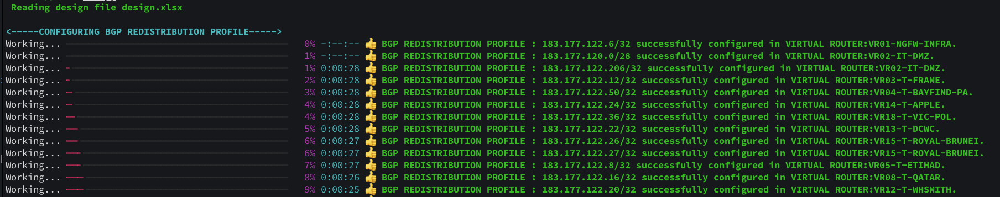

# Panorama Template COnfiguration

The Script can be used to configure the following Panorama configuration items.
It is written in pure python and uses the pan-os-python library. A reference to the python library can be found [here](https://pan-os-python.readthedocs.io/en/latest/).

It uses a spreadsheet as the source of information. A Sample can be found [here](./design.xlsx).

* Template
* Management Profile
* Aggregate Interfaces
* Ethernet Interfaces
* Layer3 Sub-Interfaces
* Loopback Interfaces
* Tunnel Interfaces
* Virtual Routers
* Virtual Systems - *Note* - will delete vsys1 by default
* Zone
* Static Route
* BGP
* BGP Authentication Profile
* BGP Peer Groups
* BGP Peers
* BGP Redistribution Profiles
* IKE Crypto Profile
* IKE Gateway
* IPSec Crypto Profile
* IPSec Tunnel
* IPSec Proxy ID.

#### TO-DO
* BGP Import Map
* BGP Export Map

# Files and Folders

* **utils** - Contains the Python functions to covert spread sheet into a iteratable dictionary.
* **config_modules** - Contains the Python functions to make the configuration changes on panorama.
* **inventory.yaml** - Contains the IP address of Panorama, the device credentials used and the name of the design spreadsheet.

# Installation

The python libraries required are captured in the [requirements.txt](./requirements.txt) file.
They can be recursively be installed using the following command.

```
pip install -r requirements.txt
```

# Execution

The script can be run by executing the [run.py](./run.py) file.

```
python run.py
```

# Logging

The script logs the status of each action performed to standard output and also writes the output to a log file
that is generated during execution. A sample logfile can be found [here](./logfile.log).

The standard output looks like:



# Author
Sudarshan Vijaya Kumar

